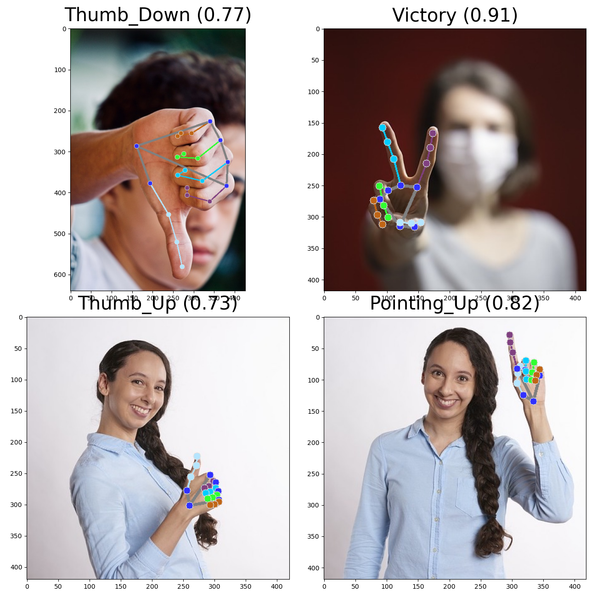

# GestureRecognition

- This is a software application for real-time gesture recognition using a camera, powered by MediaPipe.

  ### To-Do List:

  - Add an Android version
  - Train more gestures
  - Publish the custom-trained dataset

